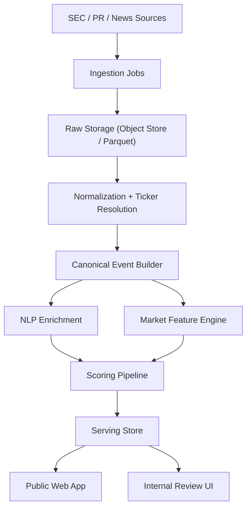

# Architecture

## System Goal

Rank unusual pre-disclosure trading behavior around official corporate events using a clear separation between offline analytics and online serving.

## Reference Architecture

## Design Principles

- raw data is immutable
- online requests never trigger heavyweight inference
- every published score has a stored explanation payload
- public pages show delayed, carefully worded research outputs
- batch jobs are idempotent and versioned

## Offline Layer

The offline layer owns:

- ingestion
- parsing
- entity resolution
- event deduplication
- NLP feature generation
- market feature generation
- scoring
- backfills

Recommended compute shape:

- Python batch jobs
- DuckDB over Parquet for local and backfill analytics
- object storage for raw and curated artifacts

## Online Layer

The online layer owns:

- ranked event lists
- event detail pages
- methodology pages
- read-only APIs

Recommended serving shape:

- `Next.js` for the public web app
- `FastAPI` for the read API
- Postgres for serving tables
- Redis for optional caching and rate limits

## Batch Publication Flow

1. Ingest raw filings and official disclosures.
2. Normalize source payloads and resolve tickers.
3. Build canonical events with `first_public_at`.
4. Generate NLP and market features.
5. Score events and build explanation payloads.
6. Publish serving rows into Postgres.
7. Refresh the public site from serving tables only.

## Operational Boundaries

### Critical Path

- event timestamp quality
- dedupe quality
- serving data freshness

### Failure Isolation

- ingestion failures should not break serving
- scoring failures should block publication for affected rows only
- public pages should degrade gracefully when optional enrichments are missing
